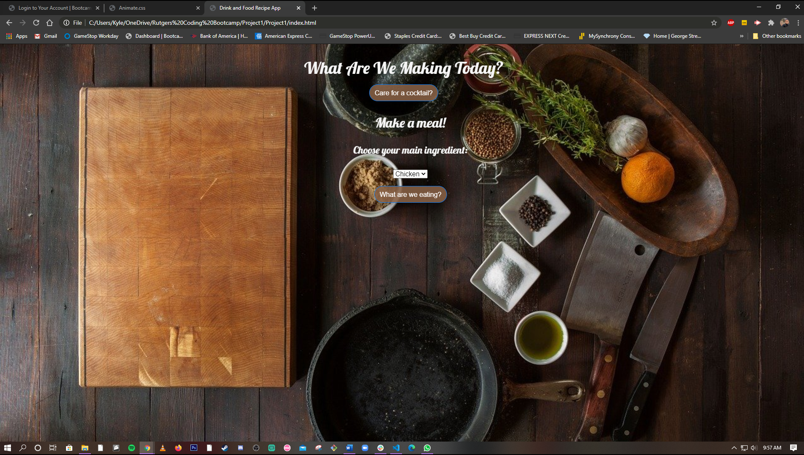

# 01 Project: The "What Are We Making Tonight?!" Application
## RutgersCodingBootcamp / RUT-JER-FSF-PT-06-2020-U-C

Team members:
- Kyle Brazier
- Alex Daddis
- Miguel Lopez
- Tashena Malloy
- Carlos Martinez

### *Description:*
For our first project, we chose to create an application that would randomize four different meals as well as cocktails on a separate link. 

Once a protein is selected, buttons of the random choice of meal appear. Each button opens a modal window with the title of the recipe, a photo of the prepared meal, a list of ingredients and their measurements, and directions on how to prepare the meal. 

The drinks portion of the application has the same functionality with a seperate link to its respective page.

### *Links:*
- [Github repository](https://github.com/BwayCarl/Project1-Meal-and-Drink-app)
- [What Are We Making Today?](https://bwaycarl.github.io/Project1-Meal-and-Drink-app/)

Below are screenshots / animations showing the app’s functionality:

.png)

.png)

